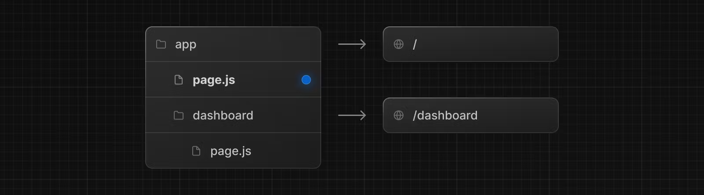

# 데이터 페칭

웹 애플리케이션을 만드는데 있어서 데이터 페칭은 중요한 부분 중 하나입니다. 이번에는 React와 Next.js에서 어떻게 데이터 페칭을 할 수 있는지 작성하겠습니다.


### 서버에서 `fetch`

Next.js에선 Web API에서 제공되는 fetch API의 확장된 버전을 제공합니다. 덕분에 Next.js에선 `fetch`로 각각의 페치 요청에 대한 캐싱(Caching)과 재검증(Revalidating) 동작을 설정할 수 있습니다.&#x20;

우리는 `fetch`를 비동기 서버 컴포넌트나 라우트 핸들러([Route Handlers](https://nextjs.org/docs/app/building-your-application/routing/route-handlers)) 등에서 사용할 수 있습니다.

```tsx
async function getData() {
  const res = await fetch('https://api.example.com/...')
  // 직렬화되지 않기 때문에 데이터 타입을 바로 사용할 수 있습니다.
 
  if (!res.ok) {
    // 에러를 던지면 가장 가까이 있는 error.tsx 파일에 걸립니다.
    throw new Error('Failed to fetch data')
  }
 
  return res.json()
}
 
export default async function Page() {
  const data = await getData()
 
  return <main></main>
}
```

클라이언트에서도 서버에서와 같은 방식으로 데이터를 페칭할 수 있습니다. 하지만 Next.js에선 보안과 성능상의 이점이 많기 때문에 서버에서의 페칭을 권장합니다.


### 데이터 캐싱(Caching)

기본적으로 `fetch`에 의해 발생한 요청은 **자동으로 캐싱**됩니다. 여러번 요청해도 저장해둔 값을 반환해 불필요한 API 호출을 줄여주죠. 캐시 데이터는 서버에 저장되어 빌드 타임 혹은 이후 요청에도 재사용할 수 있게 됩니다.

```javascript
// 'force-cache' 설정이 기본 값입니다.
fetch('https://...', { cache: 'force-cache' })
```

사실 Next.js에서는 여러 단계에 걸쳐 캐싱 동작이 수행됩니다. 데이터 캐시뿐 아니라 렌더링 단계에 있는 메모화(Memoization), 라우트 전체 캐시(Full Route Cache), 라우터 캐시(Router Cache)가 존재하죠.

이번 강의에서 메모화, 캐시에 대한 모든 것을 다루긴 어렵습니다. 지금은 데이터 캐시만을 다룬다는 점을 알고 넘어가면 혼란이 적을 것 같습니다.

<figure><figcaption></figcaption></figure>

### 데이터 재검증(Revalidating)

최신의 데이터를 원한다면 재검증을 통해 캐싱된 데이터를 무효화할 수 있습니다. 캐싱된 데이터를 재검증하는 방법에는 두 가지가 있습니다.

#### 1. 시간 기반 재검증(Time-based revalidtaion)

**특정 시간이 지난 이후에 자동으로 재검증되도록 설정**할 수 있습니다. \
\
시간이 지난 캐시 데이터는 신선하지 않은 데이터로 판별될 뿐 삭제되진 않습니다. 재요청이 있을 때 신선한 데이터를 다시 불러옵니다. 이는 데이터가 자주 변경되지 않고 신선도가 중요하지 않는 경우에 유용합니다.

```javascript
// 3600초(60분) 동안 유효한 fetch
fetch('https://...', { next: { revalidate: 3600 } })
```

<figure><figcaption></figcaption></figure>

이미지를 자세히 보시면 시간이 지한 후 STALE 되고 나서 바로 데이터를 보내줍니다. 그리고 그 후에 재검증을 하는데요. 이 말은 무엇이냐면, 재검증이란 refetch 다시 요청하는 것이 아닌 데이터가 유효한지 검사하는 역할입니다.&#x20;

그렇기 때문에 재검증을 하여 데이터가 유효하지 않다! 라고 판별이 나면 새로운 데이터가 나에게 오는 것이 아니라 한번 더 요청해야 최신 데이터를 받을 수 있습니다.

#### 2. 온디맨드 재검증(On-demand revalidtaion)

**수동으로 재검증**할 수 있습니다.&#x20;

온디맨드 재검증은 태그(tag) 혹은 경로(path)를 기반으로 특정 데이터 그룹을 일괄 재검증할 수 있습니다. 이때 재검증된 캐시 데이터는 삭제됩니다. 즉각적으로 최신 데이터를 확보해야 하는 경우에 유용합니다.

```javascript
// 데이터에 태그를 달아둡니다.
fetch('https://...', { next: { tags: ['collection'] } })

// 태그된 데이터를 재검증합니다.
revalidateTag('collection')
```

<figure><figcaption></figcaption></figure>

온디맨드 재검증 방식 또한 마찬가지 입니다. revalidateTag 함수가 실행되면, 해당 캐시를 PURGE(정지)해버립니다. 그리고 다음 호출부터 최신의 데이터를 내려줍니다.
