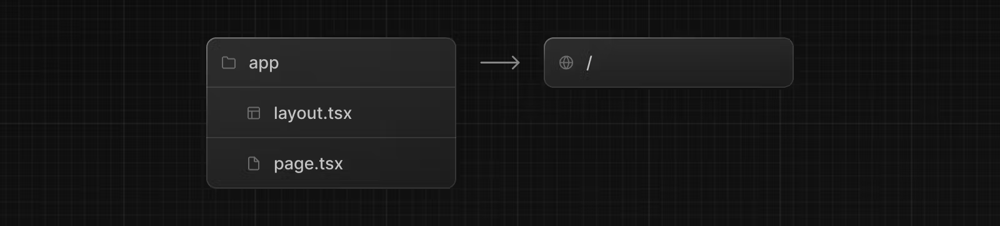

# Installation

시스템 요구 사항:

\- Node.js 16.14 이상.

\- macOS, Windows(WSL 포함) 및 Linux가 지원됩니다.


### Automatic Installation <a href="#automatic-installation" id="automatic-installation"></a>

모든 것을 자동으로 설정해주는 `create-next-app`을 사용하여 새로운 Next.js app을 시작하는 것이 좋습니다. 프로젝트를 만들려면 다음을 실행하세요:

<pre><code><strong>npx create-next-app@latest
</strong></code></pre>

설치 시 다음 메시지가 표시됩니다:

```
What is your project named? my-app
Would you like to use TypeScript? No / Yes
Would you like to use ESLint? No / Yes
Would you like to use Tailwind CSS? No / Yes
Would you like to use `src/` directory? No / Yes
Would you like to use App Router? (recommended) No / Yes
Would you like to customize the default import alias (@/*)? No / Yes
What import alias would you like configured? @/*
```

명령창이 표시되면 `create-next-app`은 프로젝트 이름으로 폴더를 생성하고 필요한 종속성을 설치합니다.


**Good to know**

\- Next.js는 기본적으로 TypeScript, EsLint 및 TailwindCSS 구성과 함께 제공됩니다.

\- 선택적으로 프로젝트 루트의 src 디렉터리를 사용하여 애플리케이션 코드를 구성 파일에서 분리할 수 있습니다.


### Manual Installation <a href="#manual-installation" id="manual-installation"></a>

새 Next.js 앱을 수동으로 생성하려면 필수 패키지를 설치하세요:

```
npm install next@latest react@latest react-dom@latest
```

package.json 파일을 열고 다음 스크립트를 추가합니다:

```
{
  "scripts": {
    "dev": "next dev",
    "build": "next build",
    "start": "next start",
    "lint": "next lint"
  }
}
```

이 스크립트는 애플리케이션 개발의 다양한 단계를 나타냅니다:

\- `dev`: `next dev`를 실행하여 개발 모드에서 Next.js를 시작합니다.

\- `build`: `next build`를 실행하여 프로덕션 용도로 애플리케이션을  빌드합니다.

\- `start`: `next start`를 실행하여 Next.js 프로덕션 서버를 시작합니다.

\- `lint`: `next lint`를 실행하여 Next.js의 내장 ESLint 구성을 설정합니다.


#### Creating directories

Next.js는 파일 시스템 기반 라우팅을 사용합니다. 즉, 파일 구조에 따라 애플리케이션의 경로가 결정됩니다.

**The `app` directory**

새로운 애플리케이션의 경우 app router를 사용하는 것이 좋습니다. app router를 사용하면 React의 최신 기능을 사용할 수 있습니다.

`app/` 폴더를 생성한 다음 `layout.tsx` 및 `page.tsx` 파일을 추가합니다. 이는 사용자가 애플리케이션의 루트(/)를 방문할 때 렌더링됩니다.

<figure><figcaption></figcaption></figure>

필수 태그인 `<html>`, `<body>` 를 사용하여 `app/layout.tsx` 내에 루트 레이아웃을 만듭니다:

<pre class="language-tsx"><code class="lang-tsx"><strong>// app/layout.tsx
</strong><strong>export default function RootLayout({
</strong>  children,
}: {
  children: React.ReactNode
}) {
  return (
    &#x3C;html lang="en">
      &#x3C;body>{children}&#x3C;/body>
    &#x3C;/html>
  )
}
</code></pre>

마지막으로 일부 초기 콘텐츠가 포함된 홈 페이지 `app/page.tsx`를 만듭니다:

<pre class="language-tsx"><code class="lang-tsx"><strong>// app/page.tsx
</strong><strong>export default function Page() {
</strong>  return &#x3C;h1>Hello, Next.js!&#x3C;/h1>
}
</code></pre>


**Good to know**

`layout.tsx` 생성을 잊어버린 경우 `Next dev`로 개발 서버를 실행할 때 Next.js가 자동으로 이 파일을 생성합니다.


**The `pages` directory (optional)**

페이지 디렉토리(선택사항)를 앱 라우터 대신 사용하려는 경우 프로젝트 루트에 `pages/` 디렉터리를 만들 수 있습니다.

그런 다음 페이지 폴더 안에 `index.tsx` 파일을 추가하세요. 이것이 귀하의 `홈 페이지(/)`가 됩니다:

```tsx
// page/index.tsx
export default function Page() {
  return <h1>Hello, Next.js!</h1>
}
```

다음으로, 페이지 내부에 \_app.tsx 파일을 추가하여 전역 레이아웃을 정의합니다. [커스텀 앱 파일](https://nextjs.org/docs/pages/building-your-application/routing/custom-app)에 대해 자세히 알아보세요.

```tsx
// pages/_app.tsx
import type { AppProps } from 'next/app'
 
export default function App({ Component, pageProps }: AppProps) {
  return <Component {...pageProps} />
}
```

마지막으로 페이지 내부에 `_document.tsx` 파일을 추가하여 서버의 초기 응답을 제어합니다. [커스텀 문서 파일](https://nextjs.org/docs/pages/building-your-application/routing/custom-document)에 대해 자세히 알아보세요.

```tsx
import { Html, Head, Main, NextScript } from 'next/document'
 
export default function Document() {
  return (
    <Html>
      <Head />
      <body>
        <Main />
        <NextScript />
      </body>
    </Html>
  )
}
```


동일한 프로젝트에서 두 라우터를 모두 사용할 수 있지만 **앱의 경로가 페이지보다 우선시됩니다.** 혼란을 피하기 위해 새 프로젝트에서는 라우터를 하나만 사용하는 것이 좋습니다.



#### The public folder (optional)

이미지, 글꼴 등과 같은 정적 자산을 저장하기 위해 `public 폴더`를 만듭니다. 그런 다음 `기본 URL(/)`에서 시작하는 코드에서 public 폴더 내의 파일을 참조할 수 있습니다.


### Run the Development Server <a href="#run-the-development-server" id="run-the-development-server"></a>

1. `npm run dev`를 실행하여 개발 서버를 시작합니다.
2. 애플리케이션을 보려면 `http://localhost:3000`에 접속하세요.
3. `app/layout.tsx`(또는 `Pages/index.tsx`) 파일을 편집하고 저장하면 브라우저에서 업데이트된 결과를 볼 수 있습니다.
